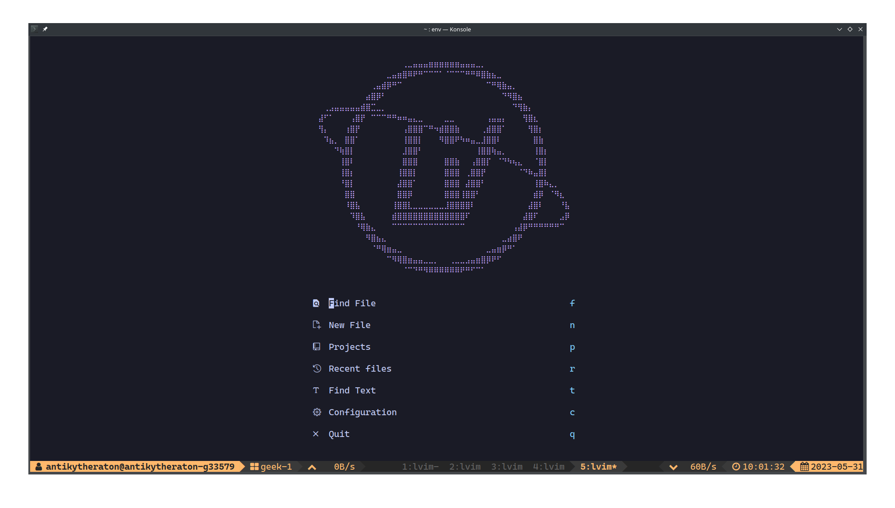
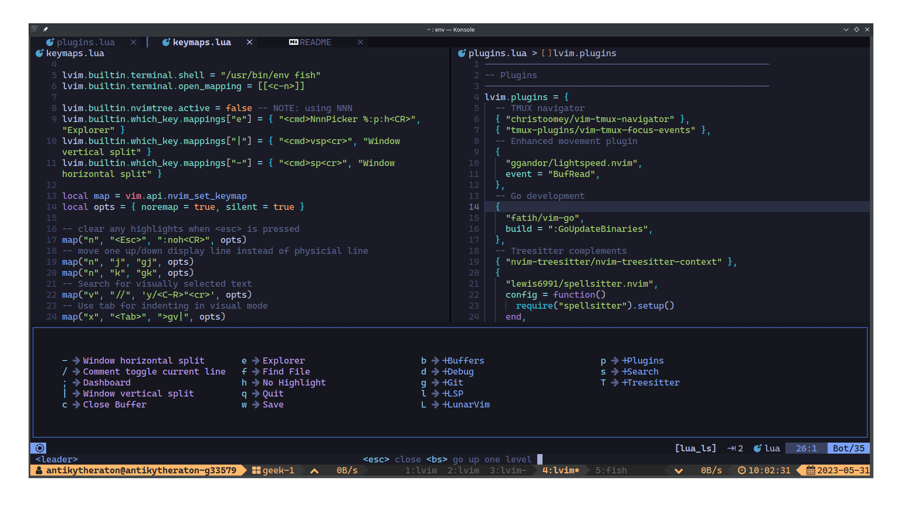

# My LunarVIM config

- Dependencies
    - [NeoVIM +v0.9.0](https://neovim.io/)
    - [git](https://git-scm.com/)
    - [tmux](https://github.com/tmux/tmux/wiki)
    - [gcc](https://gcc.gnu.org/) & [make](https://www.gnu.org/software/make/)
    - [git-delta](https://github.com/dandavison/delta)
    - [lazygit](https://github.com/jesseduffield/lazygit)
    - [fd](https://github.com/sharkdp/fd)
    - [ripgrep](https://github.com/BurntSushi/ripgrep)
    - [fzf](https://github.com/junegunn/fzf)
    - [the_silver_searcher](https://github.com/ggreer/the_silver_searcher)
    - [Fish shell v3.6](https://fishshell.com/) & [fisher](https://github.com/jorgebucaran/fisher) & [jhillyerd/plugin-git](https://github.com/jhillyerd/plugin-git)
    - [Starship shell](https://starship.rs/)
    - [nnn](https://github.com/jarun/nnn) & [nsxiv](https://github.com/nsxiv/nsxiv)
    - [Go v1.20](https://go.dev/)
    - [Rust](https://www.rust-lang.org/)
    - [Python v3.9](https://www.python.org/downloads/) & [PyEnv](https://github.com/pyenv/pyenv)
    - [NodeJS +v20.2.0](https://nodejs.org/en) & [NPM](https://www.npmjs.com/)

